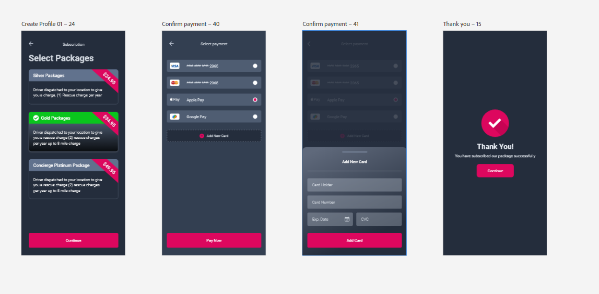
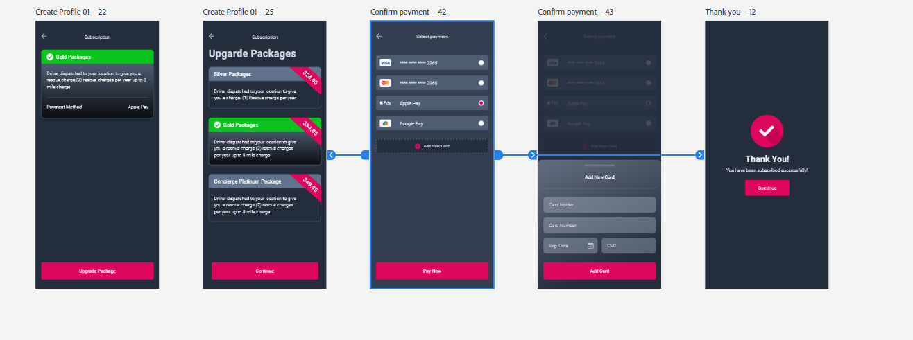

# Project: Big Dog

### Starting date: 5 April 2024

### Requested days: 45 working days

### Assigned by: Beroz bhai

# Points:

1. select login page then user, if not user fount user will be created with additional question of role, otherwise simple login (Beroz bhai)

2. remove your car detail page (Aamir bhai)

3.  it is car detail page not a subscription, remove select car and location field, number of miles field is just for data collection no impact on functionality (Aamir bhai)

4. only stripe, no google pay, no apple pay (Aamir bhai)

5. use miles for calculation instaed of percentage, distance amout will be change on top of per mile price (Aamir bhai)

6. 1 time charge will schedule for a user, price will vary on miles (Aamir bhai)

7. all of these will have call now and get a quote, and just store data in database (Aamir bhai)

8. remove deliver, seen functionlity (Aamir bhai)

9. proiducts will have no rating functionality (Aamir bhai)

10. same flow for both driver and user (Aamir bhai, beroz bhai)

11. user will have only 1 role, cannot switch or have 2 accounts from same email (beroz bhai)

12. no need to verify email and phone number (Aamir bhai)

13. one time package not a subscription (Aamir bhai)

