- Starting date: 5 April 2024
- requested days: 45 working days (Beroz bhai)

- select login page then user, if not user fount user will be created with additional question of role, otherwise simple login (Beroz bhai)

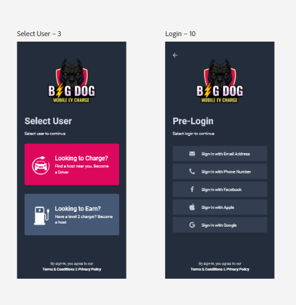

- remove your car detail page (Aamir bhai)

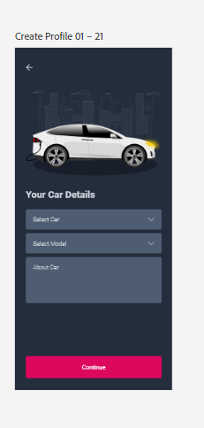

- it is car detail page not a subscription, remove select car and location field, number of miles field is just for data collection no impact on functionality (Aamir bhai)

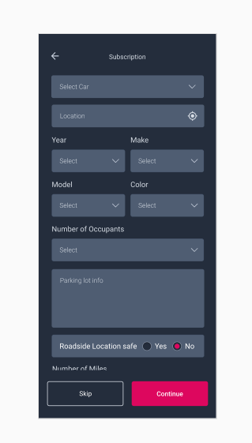

- only stripe, no google pay, no apple pay (Aamir bhai)

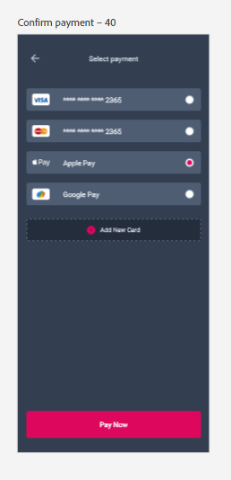

- use miles for calculation instaed of percentage, distance amout will be change on top of per mile price (Aamir bhai)

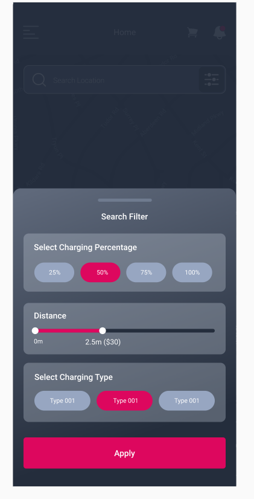

- 1 time charge will schedule for a user, price will vary on miles (Aamir bhai)

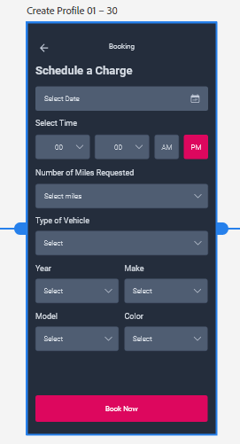

- all of these will have call now and get a quote, and just store data in database (Aamir bhai)

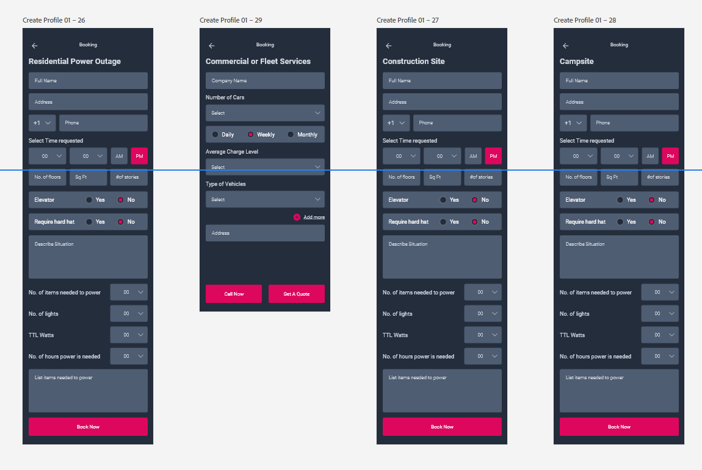

- remove deliver, seen functionlity (Aamir bhai)

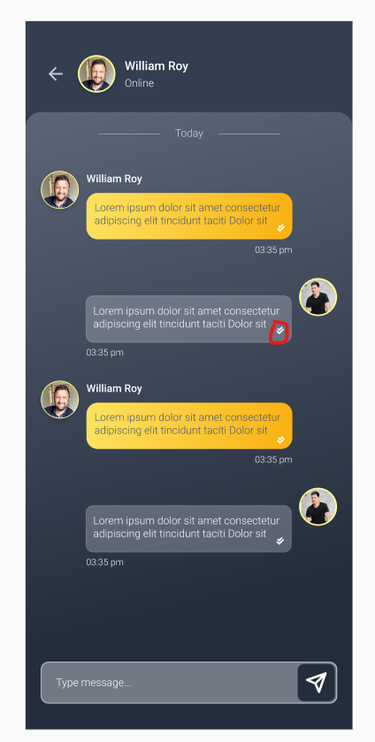

- proiducts will have no rating functionality (Aamir bhai)

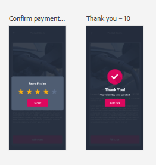

- same flow for both driver and user (Aamir bhai, beroz bhai)

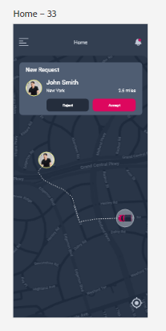

- user will have only 1 role, cannot switch or have 2 accounts from same email (beroz bhai)

- no need to verify email and phone number (Aamir bhai)

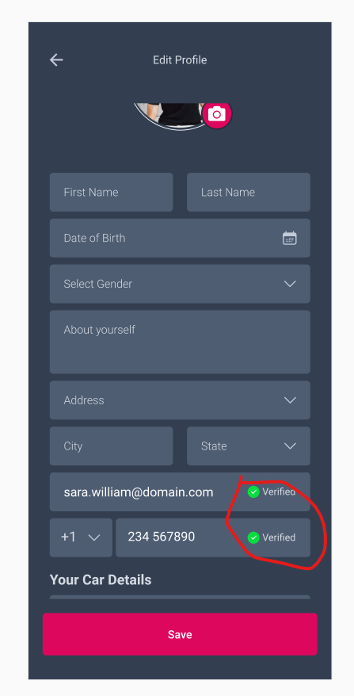
